  
  
  
  
  

---

## 👨‍💻 Acerca de mí

Ingeniero de Software con más de 4 años de experiencia en el diseño, desarrollo y despliegue de aplicaciones web de alto rendimiento. Especializado en arquitecturas basadas en **Angular** en el frontend y **NestJS** en el backend, dominio de **JavaScript** y **TypeScript**, y amplio manejo de **APIs RESTful**. Proactivo, orientado al logro y al trabajo en equipo, con capacidad de adaptación a metodologías ágiles (Scrum, Kanban) y pasión por aprender nuevas tecnologías para aportar valor inmediato al negocio.

📍 Turbo, Antioquia, Colombia &nbsp;·&nbsp; 🎯 Interesado en oportunidades en **fintech y banca**

## 💼 Experiencia actual

**Full Stack Developer Semi Senior — MET GROUP SAS** · _mayo 2022 – actualidad_

Desarrollo de plataformas de recaudo, pagos y gestión de transporte público:

- **MET•PAY** — recaudo abierto basado en cuenta (_account-based open fare collection_).
- **MET•VOA** — gestión de flota.
- **MET•SIU**.
- Soluciones implementadas para **Metrolínea**, **SI18 / TransMilenio** y **Juárez Bus**.

## 🛠️ Tecnologías

  

## 🚀 Proyectos destacados

<table>
  <tr>
    <td width="50%" valign="top">
      <h3>🌐 <a href="https://github.com/JFredMC/portfolio">portfolio</a></h3>
      
Mi portafolio personal, construido con Angular 20 y Tailwind CSS.

      
<a href="https://jfredmc.github.io/portfolio/"><b>Ver en vivo →</b></a>

      
      
    </td>
    <td width="50%" valign="top">
      <h3>🗺️ <a href="https://github.com/JFredMC/point-editor">point-editor</a></h3>
      
Editor de puntos de interés (POI) sobre mapa: crear, editar, buscar e importar/exportar GeoJSON.

      
      
      
    </td>
  </tr>
  <tr>
    <td width="50%" valign="top">
      <h3>💬 <a href="https://github.com/JFredMC/jf-chat">jf-chat</a></h3>
      
Aplicación de chat con Angular y Socket.IO.

      
      
      
    </td>
    <td width="50%" valign="top">
      <h3>🎬 Streamify</h3>
      
<a href="https://github.com/JFredMC/streamify"><b>streamify</b></a> (frontend) + <a href="https://github.com/JFredMC/streamify-back"><b>streamify-back</b></a> (API).

      
      
      
      
    </td>
  </tr>
</table>

## 📊 Estadísticas en GitHub

  
  

  

## 📚 Aprendiendo

- 🇬🇧 **Inglés** — nivel actual A2, avanzando hacia **B1**.
- 💳 Profundizando en el dominio de **fintech y banca**, a partir de mi experiencia en sistemas de pago y recaudo.

---

💬 ¿Hablamos? Escríbeme a <a href="mailto:maquiloncordoba@hotmail.com"><b>maquiloncordoba@hotmail.com</b></a> o por <a href="https://www.linkedin.com/in/jfredmc/"><b>LinkedIn</b></a>.

